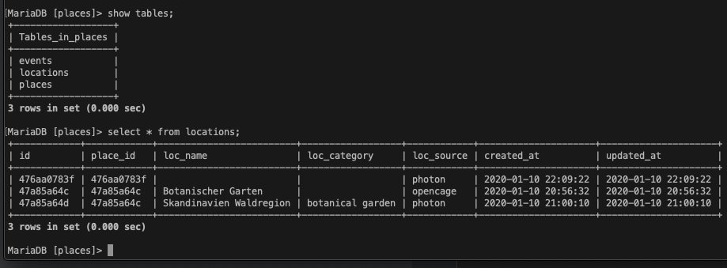

# PhotoPrism Places #

PhotoPrism bietet dir 4 hochauflösende Kartenansichten. 
Um deinen Bildern Informationen wie Land, Stadt oder Kategorie hinzuzufügen, haben wir kürzlich **PhotoPrism Places** in Betrieb genommen. 
PhotoPrism Places ist unsere eigene Geocoding API, basierend auf  OpenStreetMap.
Zusätzlich werden wir in Zukunft Informationen über öffentliche Events bereitstellen, die an bestimmten Orten stattgefunden haben. 
Dadurch können beispielsweise automatisch Alben von Musikfestivals oder Sportevents erzeugt werden.

## Datenschutz ##

Anfragen an die Geocoding API werden nicht gespeichert. Die Entwickler von *PhotoPrism Places* können jedoch zwischengespeicherte Daten in der Datenbank (MariaDB) einsehen. Diese Daten besitzen jedoch keinerlei persönliche Informationen. Die Daten werden nach dem Zufallsprinzip mit Hotspots um Touristenatraktionen und Großstädte verteilt.

Aufgrund der verwendeten HTTPS-Verschlüsselung, kann dein Internetprovider die übertragenen Daten nicht einsehen. Er kann jedoch sehen, dass du Kontakt zu einem Server aufgebaut hast.

Die Geocoding-Programmierschnittstelle nutzt ungefähre Koordinaten und kodiert sie mit [S2](https://s2geometry.io/resources/s2cell_statistics.html). Straßen und Hausnummern werden ignoriert.

## Geschwindigkeit ##

Erste [Messungen](https://github.com/tsliwowicz/go-wrk) zeigen, dass das neue System bis zu 2500 Anfragen pro Sekunde verarbeiten kann. Du kannst diese Werte gerne mit einem kommerziellen Provider vergleichen. Wir schlagen uns nicht schlecht... Die Antwortzeiten betragen zwischen 7 Mikrosekunden und 10 Millisekunden, wobei dies abhängig vom Cache und der genauen Abfrage ist.

Falls du *PhotoPrism Places* auf deinem eigenen System hosten möchtest, hier die Daten unseres Servers zum Vergleich: Wir nutzen einen Intel Xeon Prozessor mit sechs Kernen, 320GB SSD und 16GB Arbeitsspeicher. Bei einer eigenen Installation hast du mit einem zusätzlichen Download von ungefähr 100GB zu rechnen. Aufgrund der Eigenschaften von S2-Zell-IDs sollten Skalierung und Schichtung bei Bedarf leicht möglich sein.